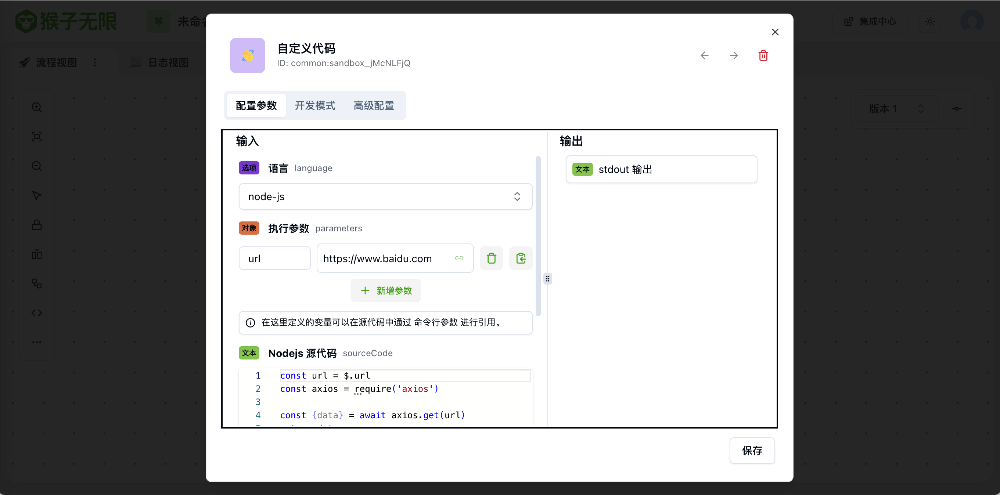
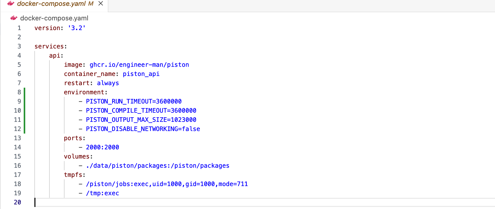
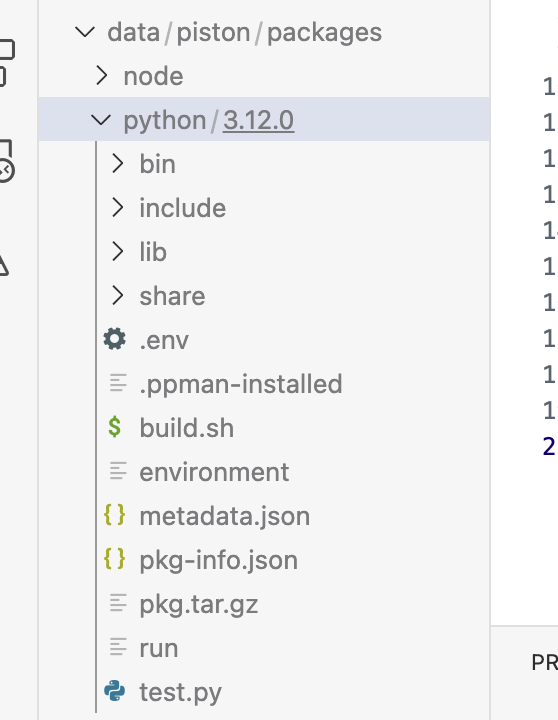
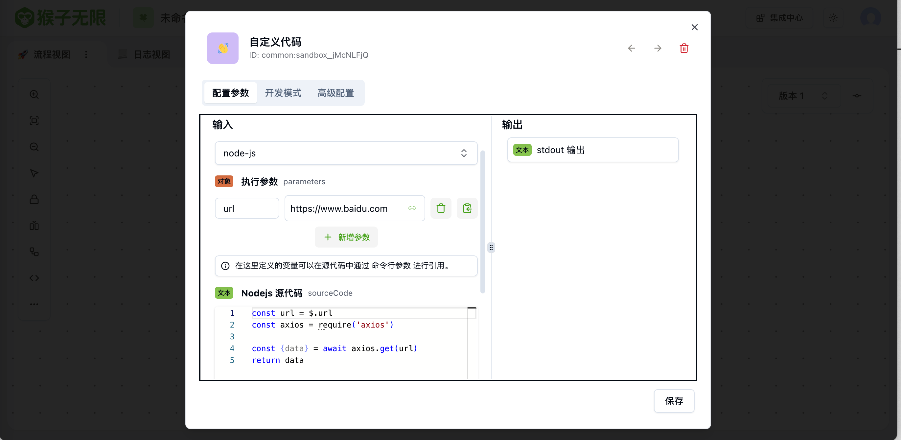
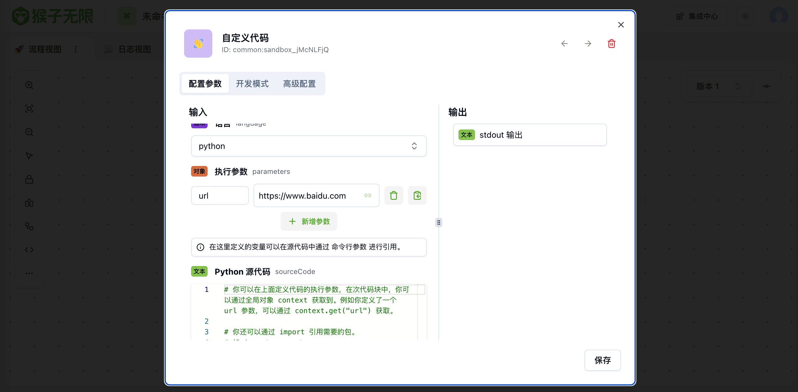

<div align="center">

# monkeys-tools-sandbox<!-- omit in toc -->

[](http://www.apache.org/licenses/LICENSE-2.0)
[](https://github.com/inf-monkeys/monkey-tools-sandbox/stargazers)
[](https://github.com/inf-monkeys/monkey-tools-sandbox)

<h3 align="center">自定义代码沙箱</h3>

</div>

## 目录<!-- omit in toc -->

- [简介](#简介)
- [安装依赖](#安装依赖)
  - [Piston（可选）](#piston可选)
- [运行](#运行)
  - [通过源码运行](#通过源码运行)
  - [通过 Docker 运行](#通过-docker-运行)
- [配置项](#配置项)
- [在 Monkeys 平台导入此工具](#在-monkeys-平台导入此工具)
  - [方式一: 通过控制台](#方式一-通过控制台)
  - [方式二: 通过配置文件](#方式二-通过配置文件)
- [示例](#示例)
  - [Nodejs](#nodejs)
  - [Python](#python)

## 简介

此工具可用来执行自定义代码。已支持语言：

- nodejs: 基于 [https://github.com/Houfeng/safeify](https://github.com/Houfeng/safeify), 无需单独安装。
- python: 基于 [https://github.com/engineer-man/piston](https://github.com/engineer-man/piston)，需要单独安装。



> 👋 如果你希望支持更多的语言，可以给我们提 PR ~

## 安装依赖

### Piston（可选）

如果你只需要运行 nodejs 自定义代码，无需安装其他额外依赖。如果你需要运行 Python 自定义代码，请按照下面的指引安装 [piston](https://github.com/engineer-man/piston)：

1. 克隆 piston 仓库

   ```sh
   git clone https://github.com/engineer-man/piston
   cd piston
   ```

2. 修改 docker-compose.yaml，设置环境变量

   设置以下环境变量:

   - PISTON_DISABLE_NETWORKING: 是否静止网络连接，设置为 false。（由于 piston 只能通过 stdout 进行数据交互，当你需要获取脚本执行的返回值时，解析会变得困难，所以我们采取写入 redis 的方式来设置返回值，需要开启网络。）
   - PISTON_RUN_TIMEOUT: 脚本执行超时时间， 默认为 3000 (ms)，可根据你的需求进行调整。
   - PISTON_COMPILE_TIMEOUT: 脚本编译超时时间，默认为 10000 (ms)，可根据你的需求进行调整。
   - PISTON_OUTPUT_MAX_SIZE: 执行 stdout 以及 stderr 最大长度，默认 1024，可根据你的需求进行调整。

   ```sh
   environment:
      - PISTON_DISABLE_NETWORKING=false
      - PISTON_RUN_TIMEOUT=3600000
      - PISTON_COMPILE_TIMEOUT=3600000
      - PISTON_OUTPUT_MAX_SIZE=1024000
   ```

   

3. 运行 `piston`

   此 `docker-compose.yaml` 默认使用以下 volume，你可以按照自己的情况进行修改。

   ```yaml
   - ./data/piston/packages:/piston/packages
   ```

   ```sh
   docker-compose up -d
   ```

   执行之后，目前 piston 还是一个空盒，还需要继续安装 Python runtime.

4. 安装 Python Runtime (有网环境)

   - 安装 cli 工具：

     ```sh
     cd cli && npm i && cd -
     ```

   - 修改 `packages/python/3.12.0/build.sh`: 添加你需要的额外 python package, 其中 `redis` 必须包含，否则无法获取自定义代码返回值。

   

   - 安装 Python runtime

   > 注意: 如果你遇到了 run build:test it has a error: rosetta error: failed to open elf at /lib64/ld-linux-x86-64.so.2 错误，这表示你的宿主机使用的是 MacOS Arm 架构，但是容器为 x86 架构无法执行。你需要使用 x86 linux 服务器来运行。

   ```sh
   cli/index.js ppman install python
   ```

   - 检验 Python Runtime 是否安装成功：

   访问 [http://localhost:2000/api/v2/runtimes](http://localhost:2000/api/v2/runtimes) 查询 python 依赖是否已安装成功。

   - 检验 python package 是否安装成功：

   进入到容器（`docker exec -it piston_api bash`），切换到 `/piston/packages/python/3.12.0` 目录，执行 `./bin/pip3 list` 查看 package 是否成功安装。如果没有安装成功，你可以手动执行 `./bin/pip3 install xxxxx` 来进行手动安装。

   > 提示：如果安装成功之后运行 Tool 提示 runtime 不存在或者 package 不存在，你可能需要重启 pod。

5. 安装 Python Runtime (无网环境)

将提前安装好的 runtime 以及对应的 package mount 进容器的 `/piston/packages` 目录，结构如下:

</a>

## 运行

### 通过源码运行

1. 克隆 GitHub 仓库

   ```sh
   git clone https://github.com/inf-monkeys/monkey-tools-sanbox.git
   ```

2. 安装 Node modules

   ```sh
   yarn
   ```

3. 启动 server:

   > 此项目默认运行在 8001 端口.

   ```sh
   yarn start:debug
   ```

### 通过 Docker 运行

**Dockerhub 地址**: [https://hub.docker.com/r/infmonkeys/monkey-tools-sandbox](https://hub.docker.com/r/infmonkeys/monkey-tools-sandbox).

使用下面的命令运行:

```bash
docker run --name monkey-tools-sanbox -d -p 8001:8001 -v /path/to/config.yaml:/etc/monkey-tools-sandbox/config.yaml -v /path/to/packages:/piston/packages monkey-tools-sandbox:latest
```

> 如需使用特定版本，你可以从 docker hub 中查询镜像 tag。

## 配置项

- `sandbox.piston`(如果只使用 nodejs 可以不填):
  - `apiServer`: Piston Server 地址
  - `runTimeout`: 默认为 3000(ms)，请与 Piston 的 PISTON_RUN_TIMEOUT 值保持一致。
  - `compileTimeout`: 默认为 10000(ms)，请与 Piston 的 PISTON_RUN_TIMEOUT 值保持一致。
- `redis`(如果只使用 nodejs 可以不填):
  - `url`: Redis 地址

```yaml
sandbox:
  piston:
    apiServer: http://localhost:2000
    runTimeout: 3600000
    compileTimeout: 3600000

redis:
  url: redis://localhost:6379
```

## 在 Monkeys 平台导入此工具

### 方式一: 通过控制台

在控制台的 **执行类工具** 菜单，点击右上角的导入按钮，输入此工具的 `manifest.json` 地址，点击确定。

```
http://127.0.0.1:8001/manifest.json
```

> 可按照你的具体情况做修改。


### 方式二: 通过配置文件

将此工具的 `manifest.json` 地址注册到 `monkeys` 服务的 `config.yaml` 中 `tools` 数组中:

```yaml
tools:
  - name: sandbox
    manifestUrl: http://127.0.0.1:8001/manifest.json
```

之后重启服务。

## 示例

### Nodejs

- 引用参数：通过全局变量 `$`。
- 引入包：通过 `require` 进行引入。

示例代码：

```javascript
// 您可以在上述的执行参数中定义需要引用的变量，例如您定义了一个名为 url 的变量，可以通过 $.url 进行引用。您还可以通过 require 引用需要的包。
// 此 JS 沙箱环境支持 Node.js 14 版本，支持 async/await 语法。
// 最终您需要通过 return 语句返回最终的结果。

const axios = require('axios');
const { data } = await axios.get($.url);
return data;
```



### Python

- 引用参数：通过全局变量 `context`。
- 引入包：通过 `import`

示例代码：

```python
# 你可以在上面定义代码的执行参数，在次代码块中，你可以通过全局对象 context 获取到。例如你定义了一个 url 参数，可以通过 context.get("url") 获取。

# 你还可以通过 import 引用需要的包。
# 如 import requests

import requests

url = context.get('url')

r = requests.get(url)

return r.text
```


